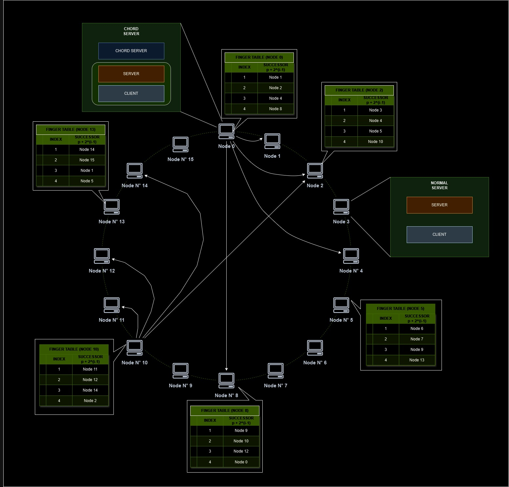
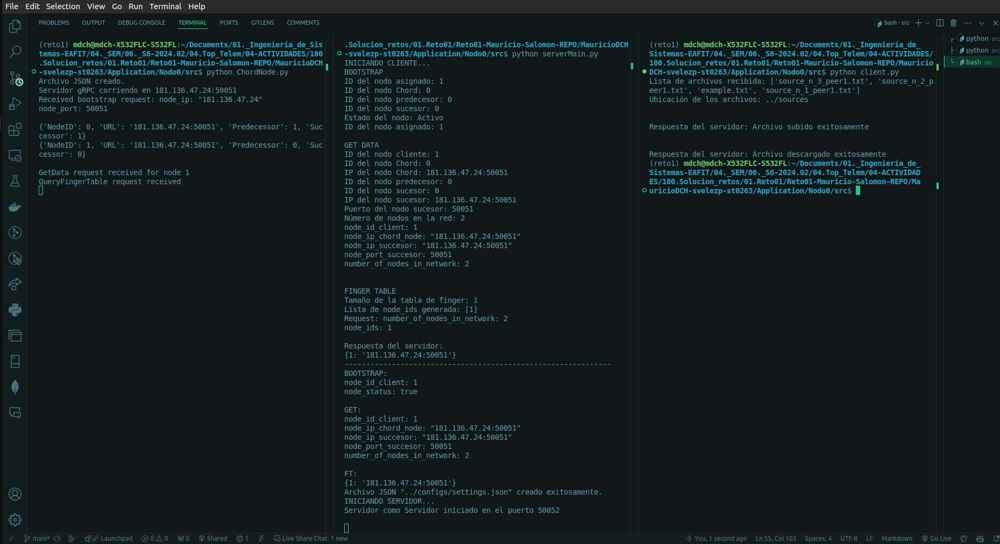

# Info de la materia: ST0263-242 Tópicos Especiales en Telemática.

# Estudiantes

| [<br><sub>MURICIO DAVID CORREA HERNÁNDEZ.<br>Correo: mdcorreah@eafit.edu.co</sub>](https://github.com/MauricioDCH) | [<br><sub>SALOMÓN VÉLEZ PÉREZ <br>Correo: svelezp10@eafit.edu.co</sub>](https://github.com/svelezp) |
| :----------------------------------------------------------------------------------------------------------------------------------------------------------------------------------------------------------: | :----------------------------------------------------------------------------------------------------------------------------------------------------: |
#
# Profesor: Edwin Nelson Montoya Múnera, emontoya@eafit.edu.co

# Nombre del proyecto: Arquitectura P2P y Comunicación entre procesos mediante API REST, RPC y MOM.
#
# 1. Breve descripción de la actividad

Se  busca desarrollar un sistema P2P descentralizadoe, estructurada en anillo, en el que los nodos puedan comunicarse entre ellos y con el que se simule la transferencia de archivos entre nodos.

## 1.1. Que aspectos cumplió o desarrolló de la actividad propuesta por el profesor (requerimientos funcionales y no funcionales)
Creacion de nodos, asignacion de las respectiva finger table de cada nodo mientras van entrando los nodos, conformacion de un servidos encargado de registrar los nodos del sistema con sus respectivas IDs e IPs, se realizo esto en local. Servicios dummies de carga y descarga de archivos, petición de la lista de archivos a un nodo identifiaco, manejo de Bootstrap, actualizar la información de los nodos si hay cambio en la información del bootstrap.


## 1.2. Que aspectos NO cumplió o desarrolló de la actividad propuesta por el profesor (requerimientos funcionales y no funcionales)

Despliegue en contenerizacion con docker, despliege en AWS, redirección de peticiones, verificación de los nodos activos.

# 2. Información general de diseño de alto nivel, arquitectura, patrones, mejores prácticas utilizadas.



# 3. Descripción del ambiente de desarrollo y técnico: lenguaje de programación, librerias, paquetes, etc, con sus numeros de versiones.

El lenguaje usado ha sido python, con archivos .proto para la comunicacion con grpc. 

Las librerias usadas son las siguientes:

- blinker
- certifi
- charset-normalizer
- click
- Flask
- grpcio
- grpcio-tools
- idna
- itsdangerous
- Jinja2
- MarkupSafe
- pip
- protobuf==5.27.2
- requests
- setuptools
- urllib3
- Werkzeug
- ujson
- pandas

## Como se compila y ejecuta.
Antes de todo, se debe instalar los requirements.txt. Y ejecutar el entorno virtual que se llama reto1

Se ejecuta en una terminal, se debe llegar hasta el directorio  /src de cada nodo, para el nodo 0, el script de ChordNode.py. Luego para otros nodos, serverMain.py y el nodo que vaya a hacer la petición, es el que ejecuta el archivo client.py, Cada archivo por cada nodo debe ser ejectutada en una terminal.

## Detalles del desarrollo.
El sistema se hizo usando gRPC como tecnologia de conexion entre los nodos. Cada nodo tiene la capacidad de actuar como servidor y como cliente dependiendo de la necesidad. Si un nodo actua como servidor de una peticion, pero debe re direccionar la peticion a otro nodo, este nodo seria ahora un cliente.
## Detalles técnicos

## Descripción y como se configura los parámetros del proyecto (ej: ip, puertos, conexión a bases de datos, variables de ambiente, parámetros, etc)
Dentro de la clase serve, se configura el puerto 50051 en el que se iniciara el nodo servidores.

## Opcional - detalles de la organización del código por carpetas o descripción de algún archivo. (ESTRUCTURA DE DIRECTORIOS Y ARCHIVOS IMPORTANTE DEL PROYECTO, comando 'tree' de linux)

Para todos los nodos --> Nodo0, Nodo1, Nodo2, Nodo3, Nodo4, Nodo5
``` bash
Nodo0
├── configs
│   ├── settings_Chord_Node.json
│   └── settings.json
├── requirements.txt
├── reto1
│   ├── ...
├── sources
│   ├── example.txt
│   ├── source_n_1_peer0.txt
│   ├── source_n_2_peer0.txt
│   └── source_n_3_peer0.txt
└── src
    ├── bootstrap.py
    ├── ChordNode.py
    ├── client.py
    ├── FingerTableGenerator.py
    ├── getData.py
    ├── __init__.py
    ├── peerCommunications_pb2_grpc.py
    ├── peerCommunications_pb2.py
    ├── peerCommunications_pb2.pyi
    ├── protos
    │   └── peerCommunications.proto
    ├── __pycache__
    │   ├── bootstrap.cpython-312.pyc
    │   ├── createSettings.cpython-312.pyc
    │   ├── FingerTableGenerator.cpython-312.pyc
    │   ├── getData.cpython-312.pyc
    │   ├── __init__.cpython-312.pyc
    │   ├── peerAsServer.cpython-312.pyc
    │   ├── peerCommunications_pb2.cpython-312.pyc
    │   ├── peerCommunications_pb2_grpc.cpython-312.pyc
    │   └── resourcesIndexer.cpython-312.pyc
    ├── serverAsClient.py
    ├── serverAsServer.py
    └── serverMain.py

```
## 
## Opcionalmente - si quiere mostrar resultados o pantallazos 



# 4. Descripción del ambiente de EJECUCIÓN (en producción) lenguaje de programación, librerias, paquetes, etc, con sus numeros de versiones.

No se logro el despliegue, pero los recursos necesarios solo seria instalar docker en la maquina linux y descargar la imagen del docker
# IP o nombres de dominio en nube o en la máquina servidor.
Se había iniciado con algunas máquinas en AWS, pero al no estar instalado en AWS, no se da más información.
## Descripción y como se configura los parámetros del proyecto (ej: ip, puertos, conexión a bases de datos, variables de ambiente, parámetros, etc)
Se había iniciado con algunas máquinas en AWS, pero al no estar instalado en AWS, no se da más información.
## Como se lanza el servidor.
Se había iniciado con algunas máquinas en AWS, pero al no estar instalado en AWS, no se da más información.
## Una mini guia de como un usuario utilizaría el software o la aplicación
Se había iniciado con algunas máquinas en AWS, pero al no estar instalado en AWS, no se da más información.

## Opcionalmente - si quiere mostrar resultados o pantallazos 
Se había iniciado con algunas máquinas en AWS, pero al no estar instalado en AWS, no se da más información.
# 5. Otra información que considere relevante para esta actividad.

# Referencias:
No se tomaron referencias de repositorios para el trabajo. Se hizo de acuerdo con la información del libro y de la clase.
Libro: Distributed Systems Maarten van Steen - Andrew S Tanenbaum 4ed
